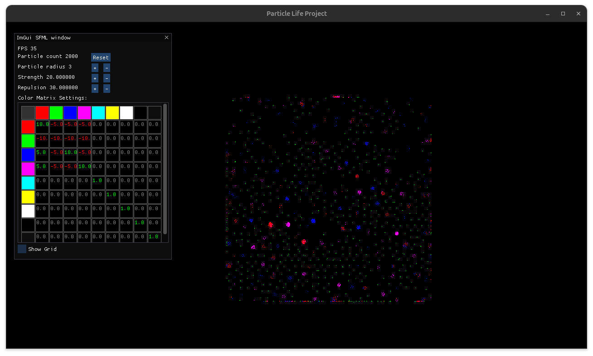

# PARTICLE LIFE (WORK IN PROGRESS )

This program is a simulation of **living particles** with a defined set of rules that results in a peculiar behaviour.

The particles are **bound to a box** and dies if they touch the bounds of the box.

Each type of particle **(defined by color)** have a specific behaviour of attraction or repulsion to each other and with other particles.



## INSTALL
To run the program, first download the repository in your prefered folder, you can use this command from terminal :
```bash
 git clone https://github.com/tharu62/Gravity_simulation.git
```
Then you will need to build the program using CMake. On **Windows 11** you will need to install the necessary MingW compiler compatible with SFML Ver.3.0.X
You can find all necessary information in their website. 

To compile on **Windows 11**, from the Particle_Life directory use this commands from terminal :
```bash
 cmake -S . -B build -G "MinGW Makefiles"
 cmake --build build
```

To compile on **Linux**. from the Particle_life directory use this commands form terminal :
```bash
 cmake -B build
 cmake --build build
```
## RUN
To run the program run this on terminal:
```bash
  build/bin/main help
```

```bash 
  _   _                        __ ___                     _      
 | | | |                      / /|__ \                   | |     
 | |_| |__   __ _ _ __ _   _ / /_   ) |      ___ ___   __| | ___ 
 | __| '_ \ / _` | '__| | | | '_ \ / /      / __/ _ \ / _` |/ _ \
 | |_| | | | (_| | |  | |_| | (_) / /_     | (_| (_) | (_| |  __/
  \__|_| |_|\__,_|_|   \__,_|\___/____|     \___\___/ \__,_|\___|
```     
